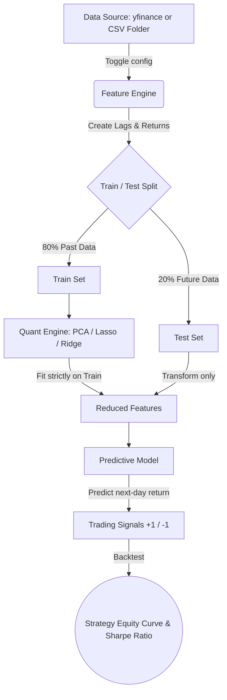

# 📈 Quantitative Trading Machine Learning Pipeline

A flexible, professional-grade Python pipeline for algorithmic trading research. This pipeline automatically ingests financial data, engineers features, reduces noise using machine learning, and evaluates out-of-sample trading performance—all while strictly preventing lookahead bias.

## 🚀 Overview

This project is built to handle the end-to-end workflow of a quantitative researcher:
1. **Data Ingestion:** Easily toggle between live Yahoo Finance data or your own local folder of CSVs.
2. **Feature Engineering:** Automatically calculates logarithmic returns and multi-day historical lags.
3. **Data Splitting:** Uses strict chronological train/test splits (no random shuffling) to prevent future data from leaking into the past.
4. **Dimensionality Reduction & Selection:** Choose between **PCA**, **Lasso (L1)**, or **Ridge (L2)** to extract the most important signals from your data.
5. **Predictive Modeling & Backtesting:** Trains a predictive model on the reduced features and generates actionable Long/Short signals to calculate a Sharpe Ratio.

---

## 📊 Pipeline Workflow

*(GitHub automatically renders this graph!)*



---

## 🛠️ Setup & Installation

You will need the following Python libraries installed. You can install them via pip:

```bash
pip install pandas numpy scikit-learn yfinance matplotlib
```

---

## 📖 How to Use the Pipeline (Cell by Cell Guide)

### Cell 1: Data Ingestion Configuration
At the top of the first cell, you will find a toggle. 
* Set `USE_FOLDER = False` to download live data using `yfinance`.
* Set `USE_FOLDER = True` and provide your folder path to load custom CSV files.

### Cell 2: Train-Test Split
Run this cell to split your data. It intentionally does *not* shuffle the data. In finance, training on tomorrow's data to predict today's price is a deadly mistake (lookahead bias). This cell ensures your model only sees the past.

### Cell 3: The Quant Engine (Feature Reduction)
Change the `METHOD_CHOICE` variable to `'pca'`, `'lasso'`, or `'ridge'`.

**🔍 What to look for in the Output of Cell 3:**
* **If you chose PCA:** Look at the print statement. It will tell you how many Principal Components were kept to explain 85% of the variance. *Goal: Compress many correlated assets into a few core market drivers.*
* **If you chose Lasso:** Look at how many features were selected. Lasso aggressively pushes irrelevant feature weights to exactly `0.0`. *Goal: Throw away useless data and keep only the strongest predictors.*
* **If you chose Ridge:** Ridge keeps *all* features but shrinks their weights to prevent overfitting. Look at the `alpha` value chosen by the Cross-Validation—a higher alpha means the model applied heavier regularization.

### Cell 4: Predictive Modeling & Backtesting
This cell trains a Linear Regression model on your reduced features, predicts tomorrow's returns, and calculates a basic Long/Short trading strategy.

**🔍 What to look for in the Output of Cell 4:**
* **RMSE (Root Mean Squared Error):** Lower is better. It measures how far off the predicted returns were from the actual returns.
* **Strategy Sharpe Ratio:** This is the golden metric in quantitative finance. It measures your return *per unit of risk*. 
  * `> 1.0` is good.
  * `> 1.5` is excellent.
  * `< 0.0` means the strategy lost money.
* **The Equity Curve Graph:** The graph at the bottom compares your AI Strategy (Green line) against a simple Buy & Hold strategy (Gray dashed line). *Goal: You want your green line to finish higher and have smoother upward growth (less violent drops) than the gray line.*

---

## ⚠️ Disclaimer
This pipeline is for educational and research purposes only. Financial markets are highly volatile, and past performance out-of-sample does not guarantee future real-world results. Always include transaction costs and slippage before trading real capital.